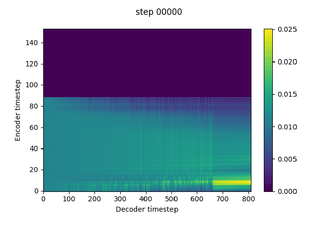
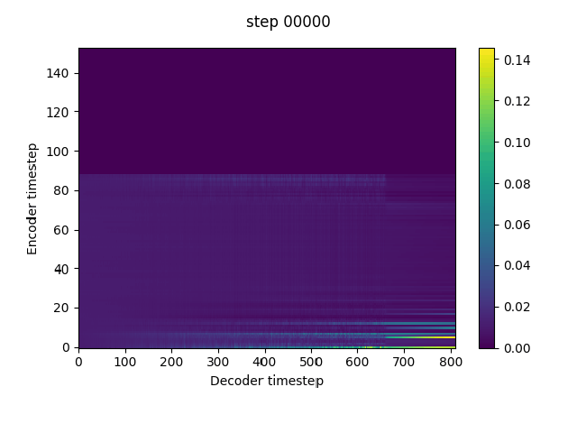

# Tacotron 2 MMI (without wavenet)
# code for Maximizing Mutual Information for Tacotron.
An updated version of the method purposed in the avoue paper.
 - gradient adaptor factor for the CTC loss instead of an increasing weight.
 - an extremely simple CTC recognizer (1 linear layer with ReLU activation) is used to force the Tacotron decoder 
 to learn a representation with plentiful linguistic information. The CTC recognizer is able to classify 
 raw acoustic features if it employs a powerful structure.

New options in hparams:
 - use_mmi (use mmi training objective or not)
 - use_gaf (use gradient adaptive factor or not, to keep the max norm of gradients 
 from the taco_loss and mi_loss approximately equal)
 - max_gaf (maximum value of gradient adaptive factor)
 - drop_frame_rate (drop teacher-frocing input frames to a certain rate)
 
This code can pick up alignment at much earlier steps than the original version.

Nvidia-Tacotron2 alignment refinement

This code

 
 
---------------------------
                    

PyTorch implementation of [Natural TTS Synthesis By Conditioning
Wavenet On Mel Spectrogram Predictions](https://arxiv.org/pdf/1712.05884.pdf). 

This implementation includes **distributed** and **automatic mixed precision** support
and uses the [LJSpeech dataset](https://keithito.com/LJ-Speech-Dataset/).

Distributed and Automatic Mixed Precision support relies on NVIDIA's [Apex] and [AMP].

Visit our [website] for audio samples using our published [Tacotron 2] and
[WaveGlow] models.

## Cookie Part
This code is a WIP implementation of Tacotron2 for use with Google Colab and the Pony Preservation Project.

## Setup
0. Training will require "soundtools" from Synthbot's Google Drive to be added to your Google Drive.
https://drive.google.com/drive/folders/1SWIeZWjIYXvtktnHuztV916dTtNylrpD

Right click "soundtools" in top left. And click "Add to My Drive".

1. Open the Training Notebook https://drive.google.com/file/d/1d1a4d7riehUOTofchlwo8N79n3Q7W4SK/view
2. Copy to drive (or ctrl+s)
3. Change
>archive_fn = '/content/drive/My Drive/soundtools/data/audio-trimmed-22khz/Spitfire.tar'

in the block starting with "#=== load the repo and data (Thanks Synthbot) ==="
To whatever pony you want to train i.e, if you wanted to train Zecora, change the line to

>archive_fn = '/content/drive/My Drive/soundtools/data/audio-trimmed-22khz/Zecora.tar'

File names can be found here https://drive.google.com/drive/folders/11H3IoCeFnhHll0bzjUtC-njED5tCi78f

4. Click "runtime" in top-left, click "run all".
The 2nd block will require you to copy/paste a google drive authentication code. Once that's done it, should go through every block without issue.
Once the last block says
>Starting Epoch: 0 Iteration: 0

It has started training and you can go have a walk or whatever humans do.
Roughly every hour, google will show a pop-up to check you're still there. Click "Reconnect to Runtime" or at some point it'll idle kick you.

5. Your model will be saved inside a folder called "colab" in your google drive under the name "current_model"

## Inference

## Related repos
[WaveGlow](https://github.com/NVIDIA/WaveGlow) Faster than real time Flow-based
Generative Network for Speech Synthesis

[nv-wavenet](https://github.com/NVIDIA/nv-wavenet/) Faster than real time
WaveNet.

## Acknowledgements
This implementation uses code from the following repos: [Keith
Ito](https://github.com/keithito/tacotron/), [Prem
Seetharaman](https://github.com/pseeth/pytorch-stft) as described in our code.

We are inspired by [Ryuchi Yamamoto's](https://github.com/r9y9/tacotron_pytorch)
Tacotron PyTorch implementation.

We are thankful to the Tacotron 2 paper authors, specially Jonathan Shen, Yuxuan
Wang and Zongheng Yang.

[WaveGlow]: https://drive.google.com/file/d/1WsibBTsuRg_SF2Z6L6NFRTT-NjEy1oTx/view?usp=sharing
[Tacotron 2]: https://drive.google.com/file/d/1c5ZTuT7J08wLUoVZ2KkUs_VdZuJ86ZqA/view?usp=sharing
[pytorch 1.0]: https://github.com/pytorch/pytorch#installation
[website]: https://nv-adlr.github.io/WaveGlow
[ignored]: https://github.com/NVIDIA/tacotron2/blob/master/hparams.py#L22
[Apex]: https://github.com/nvidia/apex
[AMP]: https://github.com/NVIDIA/apex/tree/master/apex/amp
